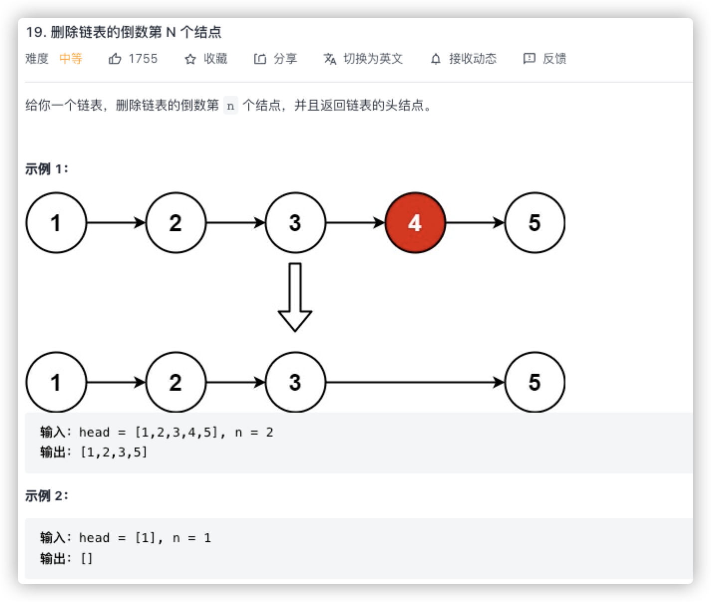

# 1. removeNth

给你一个链表，删除链表的倒数第 n 个结点，并且返回链表的头结点。



```Swift
class Solution {
    func removeNthFromEnd(_ head: ListNode?, _ n: Int) -> ListNode? {
        // 1. 链表的边界条件可以给一个dunmy node 来处理
        let dummy = ListNode(0)
        dummy.next = head
        var pre: ListNode? = dummy
        var post: ListNode? = dummy
        
        // pre 需要删除节点的前一个node, 声明另外一个post的用处是和pre保持n的距离，来实现删除倒数n的逻辑
        //1. 先移动post和pre保持n的距离
        for _ in 0..<n {
            post = post!.next
        }
        
        //2. 同时移动 pre 和 post ，使pre到到达倒数第N个节点的前一个位置
        while post!.next != nil {
            pre = pre!.next
            post = post!.next
        }
        
        // 3. 移除第n个节点
        pre!.next = pre!.next!.next
        
        
        return dummy.next
    }
}
```

强解包优化后

```Swift
class Solution {
    func removeNthFromEnd(_ head: ListNode?, _ n: Int) -> ListNode? {
        // 1. 链表的边界条件可以给一个dunmy node 来处理
        let dummy = ListNode(0)
        dummy.next = head
        var pre = dummy
        var post = dummy
        
        // pre 需要删除节点的前一个node, 声明另外一个post的用处是和pre保持n的距离，来实现删除倒数n的逻辑
        //1. 先移动post和pre保持n的距离
        for _ in 0..<n {
            guard let tempPost = post.next else {
                assert(false, "n 无效")
                return nil
            }
            post = tempPost
        }
        
        //2. 同时移动 pre 和 post ，使pre到到达倒数第N个节点的前一个位置
        while let tempPost = post.next {
            guard let tempPre = pre.next else {
                assert(false, "pre.next 无效")
                return nil
            }
            pre = tempPre
            post = tempPost
        }
        
        // 3. 移除第n个节点
        guard let needDeleteNode = pre.next else {
            assert(false, "needDeleteNode 无效")
            return nil
        }
        pre.next = needDeleteNode.next
        
        
        return dummy.next
    }
}
```

## 思路

使用双指针来确定N的距离，然后同时移动双指针，来确定位置

使用dummy node来确保 头结点的边界问题！！！！
